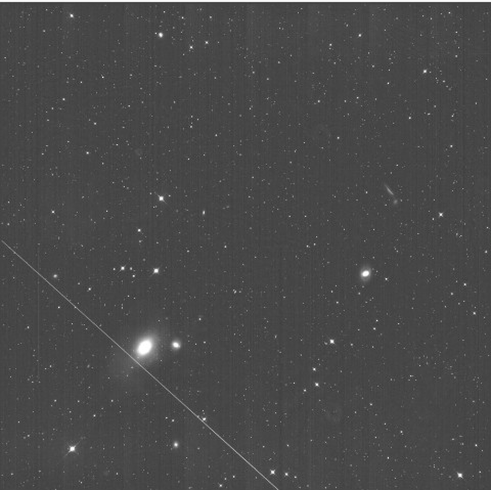
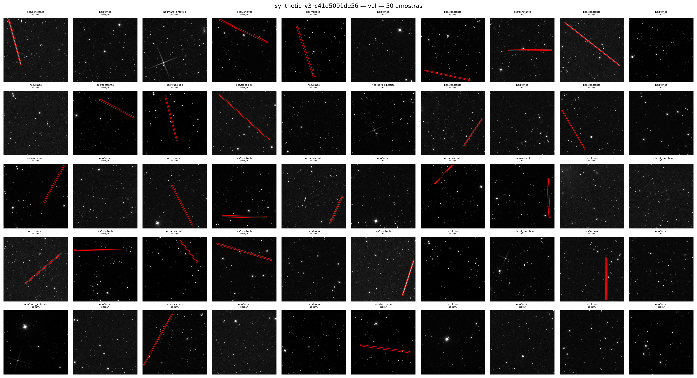
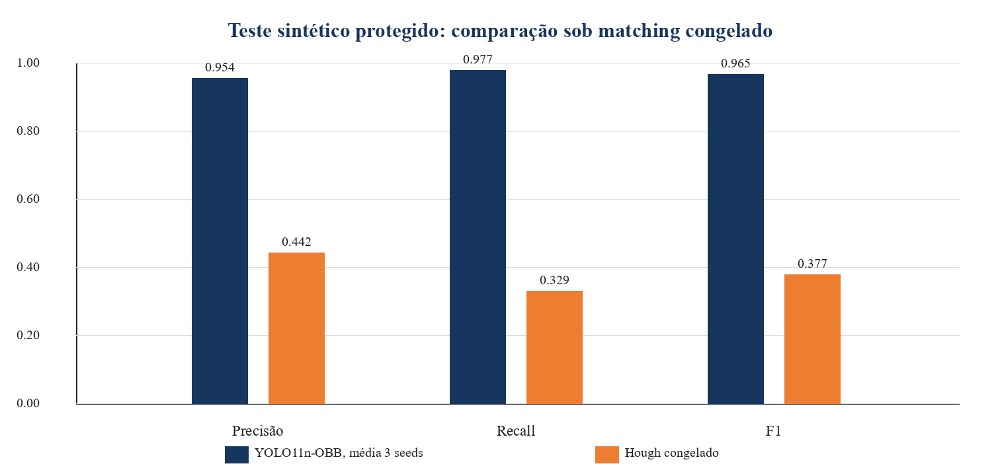
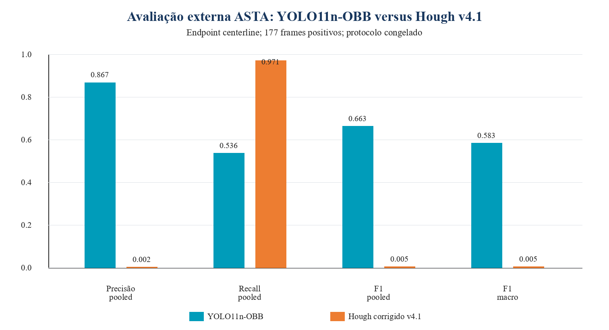
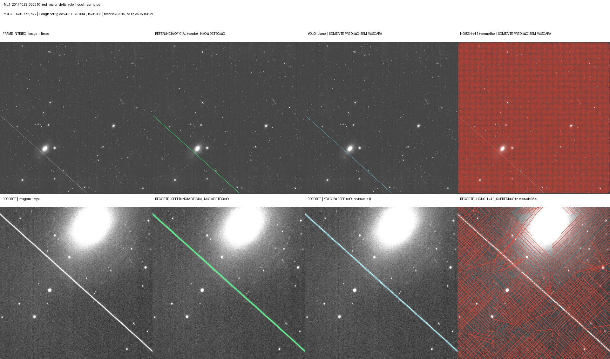

# Detecção de trilhas de satélites em imagens astronômicas

Pipeline documentado e rastreável para detectar trilhas de satélites em imagens astronômicas, comparando um detector **YOLO11n-OBB** com um baseline clássico **Canny + Transformada Probabilística de Hough**.

**Autor:** João Paulo Faustino Santos  
**Orientador:** Prof. José Bermudez  
**Curso:** Visão Computacional Master — PUC-Rio  
**Repositório:** [github.com/jpaulofsantos/satellite-streaks](https://github.com/jpaulofsantos/satellite-streaks)



*Imagem de contexto: recorte e ampliação, sem anotações, do frame `ML1_20171023_002210_red`. Fonte: Fiorenzo Stoppa, [dataset ASTA](https://doi.org/10.5281/zenodo.11642424), [CC BY 4.0](https://creativecommons.org/licenses/by/4.0/). A alteração é apenas visual; não representa nova inferência nem máscara de referência.*

## Visão geral

Trilhas de satélites podem comprometer dados astronômicos e motivam processamento automático em levantamentos, como discutem [Stoppa et al. (2024)](https://arxiv.org/abs/2407.19461) e [Carrillo Navarro et al. (2026)](https://arxiv.org/abs/2605.03429).

Este trabalho investiga se um detector de objetos com caixas orientadas, treinado com trilhas sintéticas sobre fundos reais, consegue:

- localizar trilhas com diferentes orientações e perfis de brilho;
- distinguir trilhas de fundos limpos e artefatos lineares semelhantes;
- superar um baseline clássico de Hough sob regras de avaliação explícitas e com controle de reutilização de fundos;
- generalizar para imagens reais do conjunto externo ASTA, não utilizado no treinamento ou na seleção do YOLO.

O escopo é **detectar e localizar trilhas**. O projeto não identifica o satélite responsável nem remove a contaminação da imagem.

## Principais contribuições

- geração determinística de um dataset com positivos, negativos e *hard negatives*;
- divisão por imagem de fundo antes da síntese, evitando que derivações do mesmo fundo apareçam em splits diferentes;
- anotação automática no formato YOLO-OBB;
- seleção de família e limiar somente na validação;
- treinamento final com três seeds e teste sintético executado uma única vez;
- avaliação externa no ASTA por tiles, usando métricas de *centerline* adequadas às máscaras semânticas reais;
- comparação com Hough congelado, incluindo auditoria e correção versionada de equivalência da implementação em tiles;
- manifests, seeds, contratos e artefatos rastreados por SHA-256.

## Dados

### Dataset sintético

O run final imutável é `synthetic_v3_c41d5091de56`:

| Característica | Valor |
|---|---:|
| Imagens | 6.000 |
| Positivas / negativas | 3.000 / 3.000 |
| Train / validation / test | 4.200 / 900 / 900 |
| Fundos únicos por split | 245 / 40 / 40 |
| Positivas | 60% constante, 25% variável, 15% tracejada |
| Negativas | 80% limpas, 20% *hard negatives* sintéticos |

Os fundos foram auditados por domínio. A categoria A contém frames com aparência de levantamento astronômico; a categoria B contém fundos aceitáveis somente para ampliar a diversidade do treino; a categoria C foi excluída. O split é agrupado pelo hash do fundo, não pelo nome da imagem derivada.



*Amostra da validação sintética. As caixas vermelhas são os labels OBB; imagens negativas permanecem sem caixa.*

Os dados brutos e os datasets gerados não são versionados no Git. Sua redistribuição depende das licenças das fontes. Manifests e instruções preservam a proveniência necessária para reconstrução e auditoria.

### Dataset externo ASTA

O teste real utiliza o dataset ASTA, publicado no Zenodo sob licença CC BY 4.0: [doi.org/10.5281/zenodo.11642424](https://doi.org/10.5281/zenodo.11642424).

- 178 pares imagem–máscara em escala de cinza;
- resolução de 10.560 × 10.560 pixels;
- 177 frames positivos e um negativo oficial;
- máscaras semânticas avaliadas como *centerlines*;
- processamento em tiles de 512 px, overlap de 128 px e stride de 384 px.

Imagens e máscaras ASTA foram auditadas antes da inferência externa. O conjunto não foi usado para treinar ou selecionar o YOLO. A correção Hough ocorreu após o primeiro teste e está documentada separadamente.

## Metodologia

### YOLO-OBB

YOLOv8n-OBB e YOLO11n-OBB foram comparados com uma seed, exclusivamente na validação. Como as diferenças não atingiram os limiares materiais previamente definidos, que são uma regra prática e não um teste estatístico de equivalência, o desempate pré-registrado selecionou o **YOLO11n-OBB**. O protocolo final utilizou:

- entrada de 512 × 512 pixels;
- threshold de confiança `0.45`;
- AdamW, até 100 épocas e early stopping com patience 20;
- seeds `20260823`, `20260824` e `20260825`;
- sem seleção de seed ou recalibração após observar o teste.

### Baseline Hough

O baseline aplica Canny, `HoughLinesP` e supressão geométrica de segmentos redundantes. Seus parâmetros foram calibrados somente na validação sintética e congelados antes do teste.

Na adaptação para os frames grandes do ASTA, uma auditoria identificou que a primeira implementação em tiles não era equivalente ao baseline sintético. A correção v4.1 restabeleceu a geometria e o NMS do detector congelado e substituiu a fusão transitiva por uma costura determinística de domínios de tiles. A reposição do detector por tile e a mudança de costura são intervenções distintas. A costura foi modificada após observar o teste; o YOLO manteve seu merging original. O evento original foi preservado como histórico, e a versão v4.1 fundamenta as conclusões Hough externas, com essa ressalva pós-teste.

### Avaliação

- **Sintético:** matching de OBB/geometria, precisão, recall, F1, mAP50–95 e falsos positivos em negativas.
- **ASTA:** F1 de *centerline* macro por frame positivo como endpoint primário; métricas pooled, cobertura, falsos positivos e tempo como resultados secundários.
- **Incerteza:** bootstrap agrupado por fundo no sintético e bootstrap pareado por frame no ASTA, ambos com 2.000 réplicas.

## Pipeline de notebooks

| Etapa | Notebooks | Responsabilidade |
|---|---|---|
| Fundos e curadoria | 01–02 | Coleta, padronização, hashes, auditoria de domínio e allowlist A/B/C |
| Dataset sintético | 03–05 | Split agrupado, geração determinística, validação de arquivos/labels/leakage e revisão visual |
| Baseline e transporte | 06–07 | Calibração protegida do Hough e empacotamento íntegro do dataset para GPU |
| Seleção e treino | 08–09 | Comparação YOLOv8n/YOLO11n e treinamento final multiseed do modelo selecionado |
| Teste sintético | 10 | Evento único protegido e comparação YOLO × Hough |
| Avaliação externa | 11–13 | Auditoria do ASTA, congelamento do protocolo e evento externo YOLO/Hough |
| Correção de equivalência | 15 | Auditoria Hough-only v4.1 em evento separado, sem retuning ou reexecução do YOLO |
| Consolidação final | 14 | Tabelas, figuras e análise qualitativa pós-teste, sem nova inferência |

O número dos arquivos preserva a história do desenvolvimento; por isso, na sequência de reprodução, o Notebook 15 precede a consolidação final do Notebook 14.

## Resultados principais

### Teste sintético protegido

| Método | Precisão | Recall | F1 | FP/imagem negativa |
|---|---:|---:|---:|---:|
| YOLO11n-OBB — média de 3 seeds | **0,9539** | **0,9770** | **0,9653** | **0,0000** |
| Hough congelado | 0,4418 | 0,3289 | 0,3771 | 0,2044 |

O F1 do YOLO variou de `0,9573` a `0,9734` entre as três seeds, com desvio-padrão amostral `0,0081`. O IC95% bootstrap do delta F1 YOLO − Hough foi `[0,4550; 0,6947]`.

Por perfil sintético, o recall médio YOLO foi **0,9802** (constante), **0,9676** (variável) e **0,9801** (tracejado); no Hough, **0,4185**, **0,3009** e **0,0149**. Na menor faixa de SNR-alvo (3 a 6), o recall YOLO foi **0,9022**. São análises descritivas das predições salvas; SNR-alvo não equivale a SNR fotométrico medido.



### Teste externo ASTA

| Método | F1 macro¹ | Precisão pooled | Recall pooled | F1 pooled |
|---|---:|---:|---:|---:|
| YOLO11n-OBB — seed operacional | **0,5834** | **0,8670** | 0,5362 | **0,6626** |
| Hough corrigido v4.1 | 0,0046 | 0,0023 | **0,9715** | 0,0046 |

¹ F1 de *centerline* macro nos 177 frames positivos; este é o endpoint primário comparável. **Os valores pooled arquivados têm escopos diferentes:** YOLO agrega positivos; Hough inclui também o negativo no denominador da precisão. São resultados descritivos preservados, não uma comparação pooled harmonizada.

O IC95% pareado do delta de F1 macro YOLO − Hough foi `[0,5294; 0,6287]`. O recall quase unitário do Hough **não indica boa qualidade de detecção**: o método saturou os frames com estruturas lineares espúrias, produzindo precisão extremamente baixa. O YOLO apresentou transferência parcial para dados reais, com precisão pooled elevada e recall moderado. Como os endpoints diferem entre domínios, esses números não isolam nem quantificam causalmente o efeito de domain shift.



Os valores absolutos das métricas do teste sintético e do ASTA não devem ser comparados diretamente: os domínios, referências e endpoints são diferentes.

Os tempos instrumentados foram 6,91 s/frame (YOLO) e 65,57 s/frame (Hough), sem cópia do Drive nem avaliação contra a referência. Hardware e fronteiras de preprocessamento diferem; esses valores descrevem custo operacional, não aceleração em um benchmark controlado.

## Exemplo qualitativo externo



*Caso `ML1_20171023_002210_red`, selecionado deterministicamente. As colunas mostram, separadamente: imagem limpa; referência oficial em verde; somente a predição YOLO em ciano; e somente a predição Hough v4.1 em vermelho. O verde é referência, não detecção. O YOLO obteve F1 0,9772; o Hough produziu 31.065 segmentos e F1 0,0041. Imagem e máscara de origem: Fiorenzo Stoppa, [dataset ASTA](https://doi.org/10.5281/zenodo.11642424), [CC BY 4.0](https://creativecommons.org/licenses/by/4.0/). Alterações: recortes, composição em painéis e sobreposições das predições deste estudo.*

## Estrutura do projeto

```text
.
├── README.md
├── LICENSE_PENDING.md
├── PACOTE_GITHUB.md
├── requirements-colab.txt
├── .gitignore
├── docs/
│   ├── IMAGENS_COMPILADO.md
│   ├── INVENTARIO_DRIVE_PIPELINE_V3_E_USO_DE_IMAGENS.md
│   └── README_EXECUCAO.md
├── assets/readme/
├── notebooks/
│   └── 01_...ipynb a 15_...ipynb
├── src/
│   └── build_notebooks_v3.py
├── tests/
│   └── validadores estruturais e de lógica
├── compilado-progresso-tcc-v8-abertura-visual-2026-09-07.docx
└── planner/
│   └── tcc-backup-reconciliado-2026-09-03.json
```

Os notebooks ativos estão em [`notebooks/`](./notebooks/), o gerador está em [`src/`](./src/) e as instruções completas estão em [`docs/README_EXECUCAO.md`](./docs/README_EXECUCAO.md). Resultados de diretórios legados ou de reauditorias anteriores não devem ser tratados como resultados finais.

O inventário das 16 figuras utilizadas no relatório, com seus caminhos de origem, está em [`docs/IMAGENS_COMPILADO.md`](./docs/IMAGENS_COMPILADO.md). O mapa dos diretórios e artefatos gerados no Drive está em [`docs/INVENTARIO_DRIVE_PIPELINE_V3_E_USO_DE_IMAGENS.md`](./docs/INVENTARIO_DRIVE_PIPELINE_V3_E_USO_DE_IMAGENS.md).

## Protocolo de reprodução

A execução original está documentada; uma reprodução independente em ambiente limpo ainda não foi concluída. Não use eventos protegidos existentes como destino de uma nova reprodução.

1. Clone o [repositório](https://github.com/jpaulofsantos/tcc-satellite-streaks).
2. Leia o guia [`README_EXECUCAO.md`](./docs/README_EXECUCAO.md) antes de executar os notebooks.
3. Disponibilize os dados externos no Google Drive conforme a estrutura documentada, preservando o dado bruto como somente leitura.
4. Execute os notebooks 01–13 em ordem; execute o Notebook 15 e, por último, a consolidação final do Notebook 14.
5. Não reexecute eventos já concluídos e travados. Os notebooks usam gates, manifests e hashes para impedir sobrescrita, uso prematuro do teste e mistura de versões.

Ambiente registrado nos experimentos finais:

- Google Colab;
- Python 3.13.15;
- Ultralytics 8.4.127;
- PyTorch 2.11.0 + CUDA 12.8;
- NVIDIA Tesla T4 nas etapas de treino e inferência.

GPU é necessária nos Notebooks 08, 09, 10 e 13. As demais etapas foram planejadas para CPU. Os notebooks já estão distribuídos em [`notebooks/`](./notebooks/).

## Limitações

- o treino utiliza trilhas sintéticas sobre fundos reais; o teste externo não isola causalmente o efeito de *domain shift*;
- hashes controlam reutilização exata, mas não demonstram independência entre campos celestes relacionados;
- a correção Hough inclui mudança pós-teste de costura, e os resumos pooled dos métodos têm escopos distintos;
- o ASTA contém apenas um negativo oficial, insuficiente para estimar falsos positivos reais com intervalo de confiança estável;
- uma única OBB contínua não representa explicitamente os intervalos internos de trilhas tracejadas;
- o baseline é Hough clássico e não representa pipelines híbridos U-Net + Hough ou Deep Hough;
- a inferência por tiles em frames de 10.560 × 10.560 pixels possui custo computacional relevante;
- o estudo detecta trilhas, mas não identifica o satélite nem corrige a imagem contaminada.

Esses limites orientam trabalhos futuros com adaptação de domínio, negativos reais adicionais, dados reais no treino, segmentação/centerlines e otimização da inferência em imagens grandes.

## Trabalhos relacionados

- [StreakMind: AI detection and analysis of satellite streaks in astronomical images with automated database integration](https://arxiv.org/abs/2605.03429)
- [Automated Detection of Satellite Trails in Ground-Based Observations Using U-Net and Hough Transform](https://arxiv.org/abs/2407.19461)
- [Deep Hough-Transform Line Priors](https://arxiv.org/abs/2007.09493)
- [Streak detection in the VST/OmegaCAM archive using deep learning](https://arxiv.org/abs/2606.30286)
- [Use of the Hough transformation to detect lines and curves in pictures](https://dl.acm.org/doi/10.1145/361237.361242)

## Integridade e reprodutibilidade

O projeto registra versões de dados, configurações, modelos e resultados por SHA-256. Esses hashes funcionam como identificadores de conteúdo: qualquer alteração muda o valor e impede que artefatos incompatíveis sejam combinados silenciosamente. Gates registram contratos e evitam sobrescrita. A auditoria corretiva Hough pós-teste constitui uma intervenção versionada explícita, não uma garantia de ausência de qualquer alteração posterior à primeira observação externa.

O relatório técnico consolidado está em [`Detecção de Trilhas de Satélite em Imagens Astronômicas`](./DETECÇÃO_DE_TRILHAS_DE_SATÉLITE_EM_IMAGENS_ASTRONÔMICAS.pdf).

## Licença e citação

**Dados e imagens:** o dataset ASTA, de Fiorenzo Stoppa, está disponível em [Zenodo](https://doi.org/10.5281/zenodo.11642424) sob [CC BY 4.0](https://creativecommons.org/licenses/by/4.0/). O dataset completo não acompanha este repositório; apenas as duas imagens derivadas do ASTA exibidas acima estão incluídas, com fonte e alterações indicadas nas legendas. Os demais dados externos conservam as condições de suas fontes. Ao reutilizar o ASTA, cite também o [trabalho original](https://arxiv.org/abs/2407.19461).
